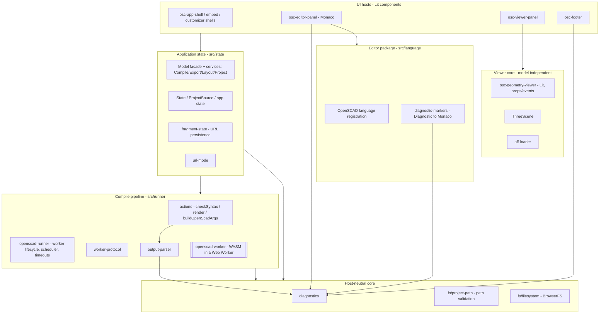

# Architecture overview

OpenSCAD Web is a fully client-side application: a Lit UI shell, a Monaco editor,
a Three.js viewer, and a persistent Web Worker that runs OpenSCAD compiled to
WebAssembly against a BrowserFS virtual filesystem. There is no server component.

This document describes how the pieces fit together and the dependency
boundaries the code is being shaped toward. It reflects the code as it is, and
calls out where a boundary is intended but not yet fully realized.

## Layers

## Module map

| Area             | Path                       | Responsibility                                                                                                                                                                                                                                                       |
| ---------------- | -------------------------- | -------------------------------------------------------------------------------------------------------------------------------------------------------------------------------------------------------------------------------------------------------------------- |
| Bootstrap        | `src/index.ts`             | Parse boot mode, init BrowserFS, construct `Model`, mount the shell                                                                                                                                                                                                  |
| State            | `src/state/`               | `Model` (central `EventTarget` façade/state owner) delegating to extracted services — `CompileCoordinator`, `ExportService`, `LayoutController`, `ProjectStore` — through a shared `ServiceContext`; `State`/`ProjectSource`, URL persistence, url-mode, deep-mutate |
| Compile pipeline | `src/runner/`              | Worker lifecycle + scheduler + timeouts, arg building, the in-worker WASM driver, the worker protocol, stderr→diagnostics parsing                                                                                                                                    |
| Diagnostics      | `src/diagnostics.ts`       | Host-neutral `Diagnostic` type + severity helpers                                                                                                                                                                                                                    |
| Filesystem       | `src/fs/`                  | BrowserFS canonical mounts, demand-loaded libraries, `project-path` validation                                                                                                                                                                                       |
| Runtime          | `src/runtime/`             | Asset URL resolution, bounded asset fetching, service worker, boot config                                                                                                                                                                                            |
| Viewer core      | `src/components/viewer/`   | `ThreeScene` (framework-free Three.js wrapper), OFF loader                                                                                                                                                                                                           |
| Editor package   | `src/language/`            | Monaco language registration, `Diagnostic`→Monaco marker adapter                                                                                                                                                                                                     |
| UI               | `src/components/elements/` | Lit components (shells, editor/viewer/customizer panels, footer)                                                                                                                                                                                                     |
| IO               | `src/io/`                  | OFF import, 3MF export, image hashing                                                                                                                                                                                                                                |

## Dependency boundaries

The cleanup epic is moving the codebase toward a clean separation between a
host-neutral core and the UI host(s). The current state of each rule:

- **No editor library in domain/runner.** ✅ Enforced by lint — a
  `no-restricted-imports` rule keeps `monaco-editor` (and other UI/editor
  packages) out of `src/state`/`src/runner` (#106). Diagnostics flow as the
  host-neutral `Diagnostic` type; the editor converts to Monaco markers via
  `src/language/diagnostic-markers.ts` at its boundary.
- **Untrusted input is validated centrally.** ✅ `fs/project-path` validates and
  bounds imported archive paths; `runtime/fetch-asset` bounds and status-checks
  asset fetches; `external-source` enforces the URL policy; `actions.formatValue`
  validates customizer values before building `-D` args.
- **Viewer core is framework-free.** ✅ `ThreeScene` has no Lit/`Model`
  dependency, and `osc-geometry-viewer` is a model-independent Lit component that
  takes OFF geometry and viewer settings as properties and emits DOM events
  (`camera-change`, `geometry-loaded`). `osc-viewer-panel` is the thin adapter
  that wires it to `Model`/`State` (#60, #61).
- **Domain is free of direct DOM access.** ✅ `Model` and the compile/state
  engine touch no `window`/`document`/`navigator`; browser side effects (object
  URLs, downloads, the completion chime, base URL) go through a `HostAdapter`
  (#59, #90). A lint rule forbids those globals in `src/state` (minus the adapter
  files) and `src/runner` (#108).

See the [ADRs](./adr/) for the decisions behind these boundaries, and
[compile-lifecycle.md](./compile-lifecycle.md) for how a compile flows end to end.
