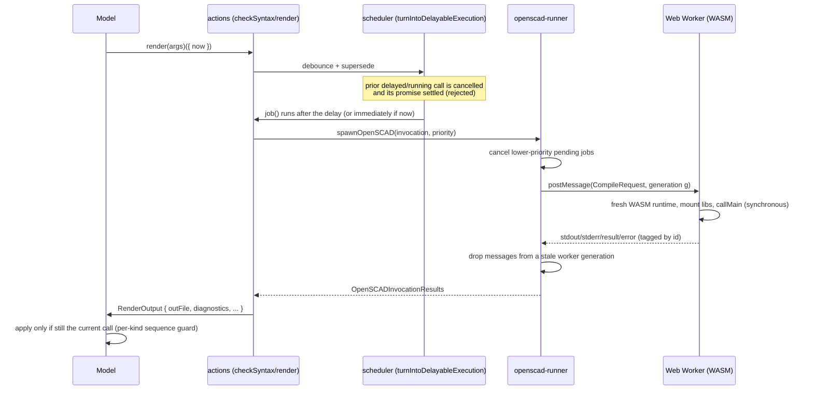
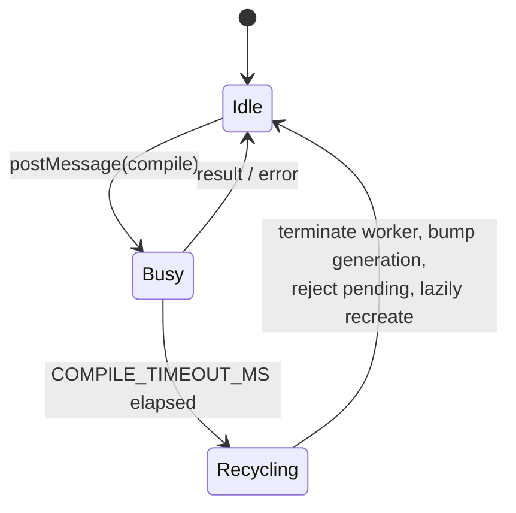

# Compile lifecycle

A "compile" is any OpenSCAD invocation: a syntax/parameter check, a preview
render, a full render, or an export pass. They all flow through the same
pipeline and share one persistent Web Worker.

## Request flow

## Scheduling and supersession

`turnIntoDelayableExecution` (`src/utils.ts`) debounces rapid calls and ensures
**every** returned promise settles exactly once — resolved, failed, or rejected
with a cancellation when superseded or killed. Each call owns its own timer and
canceller; the shared "live" canceller is identity-checked so a finished job
can't clobber a newer one. See [ADR 0003](./adr/0003-deterministic-scheduler.md).

Priorities (`syntax < preview < render < export`) let a higher-priority request
discard lower-priority **pending** jobs. Because `callMain` is synchronous, a
job already executing in the worker cannot be interrupted mid-flight.

## Timeout and worker recovery

A compile that produces no result within `COMPILE_TIMEOUT_MS` means the worker is
wedged (a synchronous `callMain` cannot be cancelled). The runner terminates the
worker, bumps a **generation** counter, rejects the pending jobs bound to that
generation, and lazily creates a clean worker on the next request. The generation
counter makes late messages from a terminated worker no-ops. See
[ADR 0002](./adr/0002-worker-timeout-recovery.md).

## Staleness defense (three layers)

A result can arrive after it is no longer wanted (user kept typing, switched
files, or triggered a higher-priority job). Stale results are dropped at three
independent layers:

1. **Worker generation** — messages from a terminated worker are ignored
   (`openscad-runner`).
2. **Scheduler settlement** — a superseded call's promise rejects rather than
   resolving with stale output (`turnIntoDelayableExecution`).
3. **Per-kind sequence guard** — `Model.render`/`checkSyntax` apply a result only
   if it is still the latest call of that kind, so a stale call can't clobber the
   `previewing`/`rendering`/`checkingSyntax` flags a newer call owns.

A project-level revision stamped onto requests/results (a cleaner single
mechanism) is deferred with the typed-contracts work; see
[ADR 0004](./adr/0004-defer-source-union.md).

## Arguments and diagnostics

`buildOpenScadArgs` (`src/runner/actions.ts`) is the single source of truth for
the OpenSCAD command line; every compile path builds through it.
`output-parser` turns OpenSCAD's stderr into host-neutral `Diagnostic`s; the
editor renders them via the Monaco adapter. See
[ADR 0001](./adr/0001-host-neutral-diagnostics.md).
